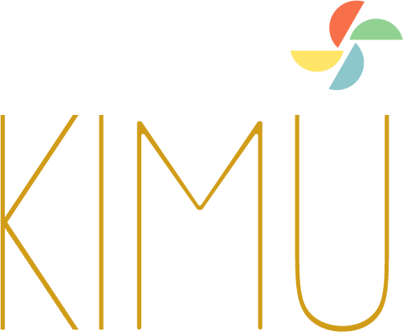

  

---

# Documentazione KIMU

Benvenuto nel repository ufficiale della documentazione del **Progetto KIMU** e, in particolare, di **KIMU-CORE**.

Creato e mantenuto da Marco Di Pasquale e dal collettivo **UnicòVerso**.

---

# 🌐 Traduzioni disponibili

- 🇬🇧 English – [README.md](./README.md)  
- 🇮🇹 Italiano – [README.it.md](./README.it.md)

---

## 🌐 Link Utili

- [Sito UnicòVerso](https://unicoverso.org)
- [Pagina Progetto KIMU](https://unicoverso.org/kimu)
- [GitHub: KIMU](https://github.com/UnicoVerso/kimu)
- [GitHub: KIMU-Core](https://github.com/UnicoVerso/kimu-core)
- [GitHub: UnicòVerso](https://github.com/UnicoVerso)
- [LinkedIn](https://www.linkedin.com/company/unicoverso)

---

## 📖 Informazioni su questa documentazione

Questo repository contiene tutta la documentazione ufficiale del Progetto KIMU, con particolare attenzione a **KIMU-CORE**—il framework open, modulare e creativo per esperienze interattive e generative.

Qui troverai:

- **Concetti e Filosofia**: Lo spirito e la visione dietro KIMU e UnicòVerso.
- **Guide per Iniziare**: Come configurare, installare e utilizzare KIMU-CORE.
- **Riferimento API**: Documentazione dettagliata dei moduli core e del sistema di estensioni.
- **Esempi & Tutorial**: Guide passo-passo e casi d'uso reali (in arrivo).
- **Best Practice**: Consigli, pattern e raccomandazioni per sviluppare con KIMU.
- **Comunità & Contributi**: Come partecipare, contribuire e connettersi con il collettivo.

> **Nota:** La documentazione è attualmente in fase di sviluppo. Stiamo aggiungendo nuove sezioni, guide e tutorial per aiutarti a entrare nell'anima, nello spirito e nella filosofia di UnicòVerso e del Progetto KIMU. Resta aggiornato!

---

## 🤝 Supporto & Feedback

Accogliamo con piacere il tuo supporto, feedback o anche solo un saluto! Sentiti libero di aprire issue, suggerire miglioramenti o contattarci sui nostri canali social. Ogni messaggio, suggerimento o contributo ci aiuta a crescere e migliorare.

Grazie per il tuo interesse e supporto.

**Buon coding!**
